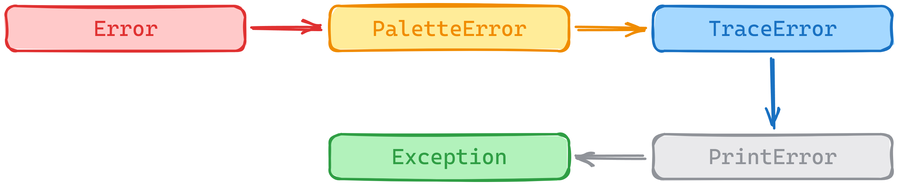
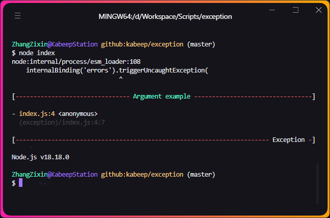
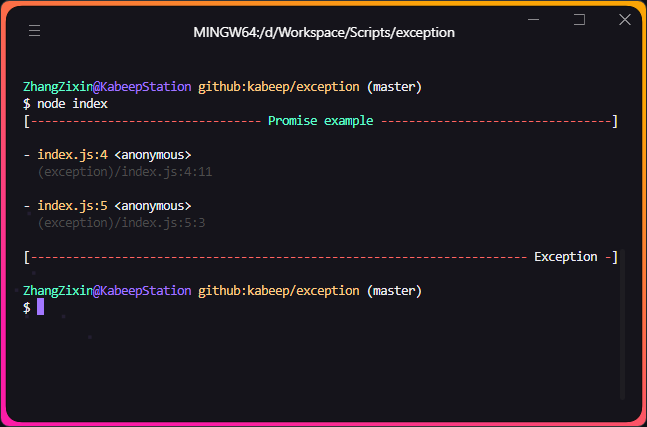
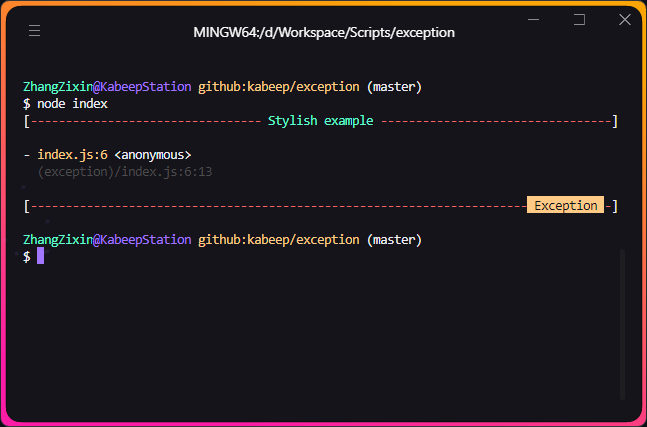
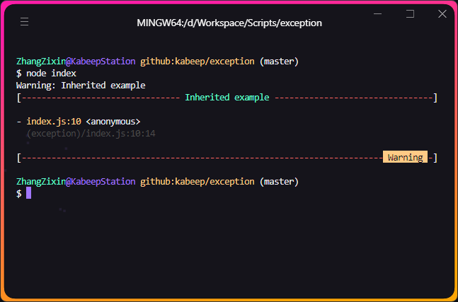
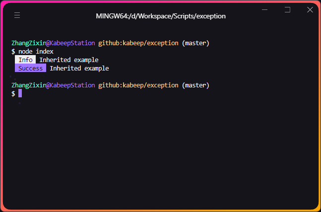

# expection

<div align="center">


Exception is a custom error library for Node.js that provides a more flexible and customizable way of handling errors.

---

[](https://nodejs.org/docs/latest/api/)
[](LICENSE)
[](https://www.npmjs.com/package/@kabeep/exception)
[](https://codecov.io/gh/kabeep/exception)
[](https://app.codacy.com/gh/kabeep/exception/dashboard)
[](https://dl.circleci.com/status-badge/redirect/circleci/Qh23T2Zgw4Fy4V8uvKaymp/JeKeBwNTskLytiuiJPdQ2R/tree/master)

English | [简体中文](README.zh-CN.md)




Inheritance and the prototype chain

</div>

## 📖 Introduction

> Inspired by the work of [sindresorhus](https://github.com/sindresorhus), I decided to open source the most repetitive
> encapsulation work I do in CLI development.


I do not like disorder. Often, unexpected situations arise due to our insufficient consideration. Therefore, I encourage
those around me to engage in more comprehensive error collection work.

The goal of Exception is to transform unexpected occurrences into anticipated outcomes as much as possible.

It allows Error objects to throw exception and stack information in a more aesthetically pleasing and intuitive manner,
and can also serve as Notify to output critical information in workflows.

## ⚙️ Installation

```bash
npm install @kabeep/exception --save
```

```bash
yarn add @kabeep/exception
```

```bash
pnpm add @kabeep/exception
```

## 🚀 Usage

### Plain text or Error object

[example](example/default.ts)



```javascript
import Exception from '@kabeep/exception';

// Plain text
throw new Exception('Argument example');

// or Error object
throw new Exception(new Error('Argument example'));
```

### Using in Asynchronous Contexts

[example](example/promise.ts)



```javascript
import Exception from '@kabeep/exception';

(
    async () => {
        throw new Exception('Promise example');
    }
)().catch(console.log);
```

### Custom Styles

[example](example/stylish.ts)



```javascript
import Exception from '@kabeep/exception';

// Use custom style with hex or rgb
const stylish = '(51,51,51).bg#f56c6c';

console.log(
    new Exception('Stylish example', stylish)
);
```

### Custom Exceptions

[example](example/extends.ts)



```javascript
import Exception from '@kabeep/exception';

// > Warning
class Warning extends Exception {
    constructor (message: string | Error) {
        super(message, '( 51 ,51, 51 ).bg#e6a23c');
    }
}

const warn = new Warning('Inherited example');
// Warning: Inherited example [Without style]
console.log(`${warn}`);
console.log(warn);
```

### Print Key Information

[example](example/extends.ts)



```javascript
import Exception from '@kabeep/exception';

// > Info
const infoStyle = '(51,51,51).bg#409eff';

class Info extends Exception {
    constructor (message) {
        super(message, infoStyle);
    }

    toString () {
        return this.info(styles);
    }
}

const tip = new Info('Inherited example');
// Without stack
console.log(`${tip}`);

// > Success
const successStyle = '(51,51,51).bg#67c23a';

class Success extends Exception {
    constructor (message) {
        super(message, successStyle);
    }

    toString () {
        return this.info(styles);
    }
}

const pass = new Success('Inherited example');
// Without stack
console.log(pass.toString());
```

## 🎨 Supported styles

- [Modifiers](https://github.com/chalk/chalk#modifiers)

```json
"dim.italic.underline"
```

- [Colors](https://github.com/chalk/chalk#colors)

```json
"magenta.cyan"
```

- [Background colors](https://github.com/chalk/chalk#background-colors)

```json
"bgMagenta.bgCyan"
```

- [Hex triplet](https://en.wikipedia.org/wiki/Web_colors#Hex_triplet)

```json
"#fff.bg#333333"
```

- [RGB model](https://en.wikipedia.org/wiki/RGB_color_model)

```json
"(51,51,51).bg(24,124,255)"
```

- [CSS keywords](https://www.w3.org/wiki/CSS/Properties/color/keywords)

```json
"cyan.bgDarkblue"
```

## 🔗 Related

- [chalk](https://github.com/chalk/chalk) - Terminal string styling done right
- [chalk-pipe](https://github.com/LitoMore/chalk-pipe) - Create chalk style schemes with simpler style strings

## 🤝 Contribution

Contributions via Pull Requests or [Issues](https://github.com/kabeep/exception/issues) are welcome.

## 📄 License

This project is licensed under the MIT License. See the [LICENSE](LICENSE) file for details.