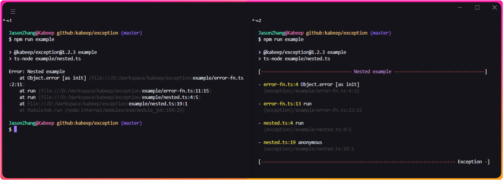
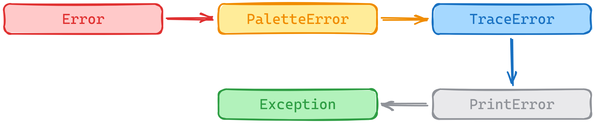
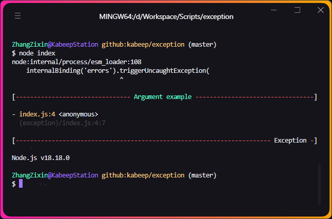
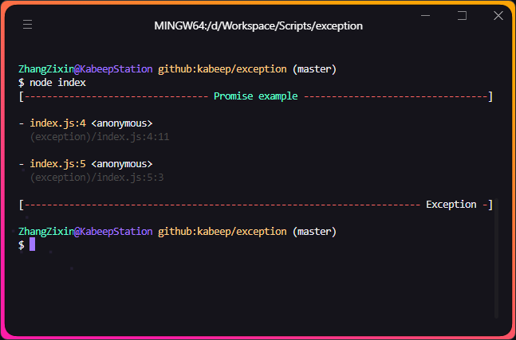
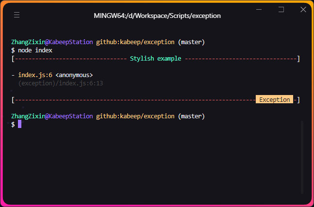
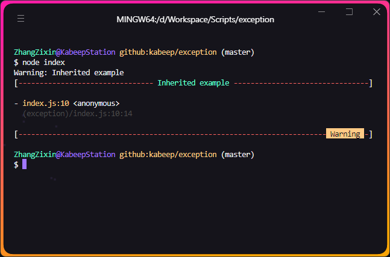
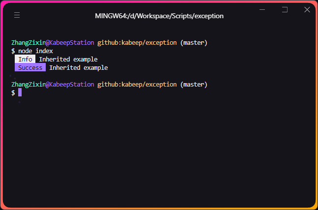

<div align="center">


Exception 是一个用于 Node.js 的自定义错误库，它提供了一种更加灵活和可定制的错误处理方式。

---

[](https://nodejs.org/docs/latest/api/)
[](LICENSE)
[](https://www.npmjs.com/package/@kabeep/exception)
[](https://codecov.io/gh/kabeep/exception)
[](https://app.codacy.com/gh/kabeep/exception/dashboard)
[](https://dl.circleci.com/status-badge/redirect/circleci/Qh23T2Zgw4Fy4V8uvKaymp/JeKeBwNTskLytiuiJPdQ2R/tree/master)

[English](README.md) | 简体中文




</div>

## 📖 简介

> 受到 [sindresorhus](https://github.com/sindresorhus) 工作的激励，我决定把自己在 cli 开发中最多重复的封装工作开源出来。

我不喜欢无序，当意外情况出现，往往由我们考虑不足导致，因此我鼓励身边的人进行更完整的错误收集工作。

Exception 的目标是尽可能的将 ~~**例外(Exception)**~~ 变为 **预期(Expectation)**。

它允许 _Error_ 对象以更美化与直观的方式将异常信息和栈信息抛出，
也可以作为 _Notify_ 在工作流中打印关键性信息。



## ⚙️ 安装

```bash
npm install @kabeep/exception --save
```

```bash
yarn add @kabeep/exception
```

```bash
pnpm add @kabeep/exception
```

## 🚀 使用

### 纯文本或错误对象

[用例](example/default.ts)



```javascript
import Exception from '@kabeep/exception';

// Plain text
throw new Exception('Argument example');

// or Error object
throw new Exception(new Error('Argument example'));
```

### 在异步中使用

[用例](example/promise.ts)



```javascript
import Exception from '@kabeep/exception';

(
    async () => {
        throw new Exception('Promise example');
    }
)().catch(console.log);
```

### 自定义样式

[用例](example/stylish.ts)



```javascript
import Exception from '@kabeep/exception';

// Use custom style with hex or rgb
const stylish = '(51,51,51).bg#f56c6c';

console.log(
    new Exception('Stylish example', stylish)
);
```

### 自定义异常

[用例](example/extends.ts)



```javascript
import Exception from '@kabeep/exception';

// > Warning
class Warning extends Exception {
    constructor (message: string | Error) {
        super(message, '(51,51,51).bg#e6a23c');
    }
}

const warn = new Warning('Inherited example');
// Warning: Inherited example [Without style]
console.log(`${warn}`);
console.log(warn);
```

### 打印关键信息

[用例](example/extends.ts)



```javascript
import Exception from '@kabeep/exception';

// > Info
const infoStyle = '(51,51,51).bg#409eff';

class Info extends Exception {
    constructor (message) {
        super(message, infoStyle);
    }

    toString () {
        return this.info(styles);
    }
}

const tip = new Info('Inherited example');
// Without stack
console.log(`${tip}`);

// > Success
const successStyle = '(51,51,51).bg#67c23a';

class Success extends Exception {
    constructor (message) {
        super(message, successStyle);
    }

    toString () {
        return this.info(styles);
    }
}

const pass = new Success('Inherited example');
// Without stack
console.log(pass.toString());
```

## 🎨 支持的颜色

- [修饰符](https://github.com/chalk/chalk#modifiers)

```json
"dim.italic.underline"
```

- [颜色](https://github.com/chalk/chalk#colors)

```json
"magenta.cyan"
```

- [背景颜色](https://github.com/chalk/chalk#background-colors)

```json
"bgMagenta.bgCyan"
```

- [十六进制数字表示法](https://en.wikipedia.org/wiki/Web_colors#Hex_triplet)

```json
"#fff.bg#333333"
```

- [三原色光模式](https://en.wikipedia.org/wiki/RGB_color_model)

```json
"(51,51,51).bg(24,124,255)"
```

- [CSS 关键字](https://www.w3.org/wiki/CSS/Properties/color/keywords)

```json
"cyan.bgDarkblue"
```

## 🔗 关联库

- [chalk](https://github.com/chalk/chalk) - 终端字符串样式
- [chalk-pipe](https://github.com/LitoMore/chalk-pipe) - 创建粉笔风格方案与更简单的风格字符串

## 🤝 贡献

欢迎通过 Pull Requests 或 [Issues](https://github.com/kabeep/exception/issues) 来贡献你的想法和代码。

## 📄 许可

本项目采用 MIT 许可证。详情请见 [LICENSE](LICENSE) 文件。
