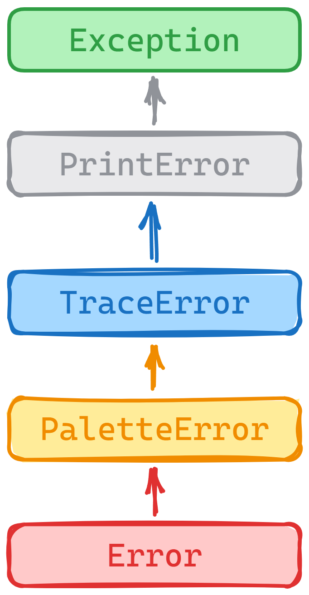

<div align="center">


Exception 是一个用于 Node.js 的自定义错误库，它提供了一种更加灵活和可定制的错误处理方式。

---


[](LICENSE)

[English](README.md) | 简体中文

</div>

## 📖 简介

> 受到 [sindresorhus](https://github.com/sindresorhus) 工作的激励，我决定把自己在 cli 开发中最多重复的封装工作开源出来。

我不喜欢无序，当意外情况出现，往往由我们考虑不足导致，因此我鼓励身边的人进行更完整的错误收集工作。

Exception 的目标是尽可能的将 ~~**例外(Exception)**~~ 变为 **预期(Expectation)**。

它允许 _Error_ 对象以更美化与直观的方式将异常信息和栈信息抛出，
也可以作为 _Notify_ 在工作流中打印关键性信息。

<div align="center">



class-inheritance

</div>

## ⚙️ 安装

```bash
npm install @kabeep/exception --save
```

```bash
yarn add @kabeep/exception
```

```bash
pnpm add @kabeep/exception
```

## 🚀 使用

### 纯文本或错误对象

[用例](example/default.ts)

```javascript
import Exception from '@kabeep/exception';

// 纯文本
throw new Exception('example');

// or 错误对象
throw new Exception(new Error('example'));
```

### 在异步中使用

[用例](example/promise.ts)

```javascript
import Exception from '@kabeep/exception';

(
    async () => {
        throw new Exception('Promise example');
    }
)().catch(console.log);
```

### 自定义样式

[用例](example/stylish.ts)

```javascript
import Exception from '@kabeep/exception';

// Use custom style with chalk color, hex and rgb
const stylish = ['51,51,51', 'bg:#f56c6c']

console.log(
    new Exception('Stylish example', stylish)
);
```

### 自定义异常

[用例](example/extends.ts)

```javascript
import Exception from '@kabeep/exception';

// > Warning
class Warning extends Exception {
    constructor (message: any) {
        super(message, [' 51,51,51 ', 'bg:#e6a23c']);
    }
}

const warn = new Warning('Inherited example');
// Warning: Inherited example [Without style]
console.log(`${warn}`);
```

### 打印关键信息

[用例](example/extends.ts)

```javascript
import Exception from '@kabeep/exception';

// > Info
class Info extends Exception {
    constructor (message: any) {
        super(message, ['51,51,51', 'bg:#409eff']);
    }

    toString () {
        return ` ${this.palette(['51,51,51', 'bg:#409eff'])(this.name)} ${this.message}`;
    }
}

const tip = new Info('Inherited example');
// Without stack
console.log(`${tip}`);

// > Success
class Success extends Exception {
    constructor (message: any) {
        super(message, ['51,51,51', 'bg:#67c23a']);
    }

    toString () {
        return ` ${this.palette(['51,51,51', 'bg:#67c23a'])(this.name)} ${this.message}`;
    }
}

const pass = new Success('Inherited example');
// Without stack
console.log(pass.toString());
```

## 🤝 贡献

欢迎通过 Pull Requests 或 [Issues](https://github.com/kabeep/exception/issues) 来贡献你的想法和代码。

## 📄 许可

本项目采用 MIT 许可证。详情请见 [LICENSE](LICENSE) 文件。